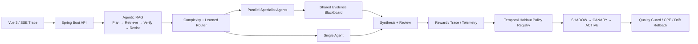

# Cortex AI Agent 智能体系统

[](https://github.com/fhs1220/spring-ai-super-agent/actions/workflows/ci.yml)

一个基于 **Java 21、Spring Boot、Spring AI、Vue 3** 的全栈 Agentic RAG 系统，重点展示
自适应多 Agent、可训练执行轨迹、离线策略评测、灰度质量守卫和安全渐进式发布。

## Interview v1.0 完成标准

- Agentic RAG：规划、混合检索、验证、补充检索、生成、审查与修正闭环；
- 自适应多 Agent：单 Agent 快速路径、5 个专业 Agent、并行综合、超时/重试/熔断/降级；
- Agent RL：奖励与遥测轨迹、时间留出验证、冻结策略资产、OPE 与漂移监控；
- 发布控制：`SHADOW → 5% → 10% → 25% → 50% → ACTIVE`、三重授权和可审计回退；
- 36 条固定基准，四路对照传统 RAG、强制单 Agent、强制多 Agent和自适应路由；
- Java 21 可复现测试、显式集成测试分层、Vue 生产构建、GitHub Actions
  和单命令工程验收。

真实模型指标不会写死或伪造。运行全量评测后，JSON 与 Markdown 报告会落在
`tmp/evaluation/`。面试讲解顺序见
[`docs/INTERVIEW_GUIDE.md`](docs/INTERVIEW_GUIDE.md)，评测设计见
[`docs/EVALUATION.md`](docs/EVALUATION.md)，训练数据的离线生成、Benchmark 防污染和
双重授权回放见
[`docs/TRAINING_DATA_PIPELINE.md`](docs/TRAINING_DATA_PIPELINE.md)，首次真实 RLVR v3
试回放的量化证据见
[`docs/RLVR_V3_PILOT_REPORT.md`](docs/RLVR_V3_PILOT_REPORT.md)，从分层回放到四臂训练、
正式评测和灰度上线的剩余工作见
[`docs/RL_COMPLETION_PLAN.md`](docs/RL_COMPLETION_PLAN.md)。v2 首次单双 Agent 分层回放
及引用门禁修复证据见
[`docs/RLVR_V3_STRATIFIED_PILOT_REPORT.md`](docs/RLVR_V3_STRATIFIED_PILOT_REPORT.md)，
50 题 × 2 轮的 Stage 2 真实扩量结果见
[`docs/RLVR_V3_STAGE2_50X2_REPORT.md`](docs/RLVR_V3_STAGE2_50X2_REPORT.md)。

---

# 项目架构



---

# 项目功能

### 多轮 AI 对话与会话记忆
系统支持多轮对话能力，通过 ChatMemory 模块维护会话上下文，实现连续对话中的语义承接。

- 会话级 Chat Session 管理
- 对话上下文自动传递
- 内存存储与文件存储两种 ChatMemory 实现
- 支持复杂对话场景中的上下文理解

---

### RAG 知识库问答

系统实现完整的 **Retrieval Augmented Generation (RAG)** 流程，用于增强 AI 回答的准确性。

RAG Pipeline 包括：

- 文档加载（Document Loader）
- 文本切分（Text Splitter）
- 文本向量化（Embedding）
- 向量存储（PGVector Vector Store）
- Agentic 检索规划（Plan）
- 多查询语义检索与去重（Retrieve）
- 上下文充分性验证（Verify）
- 缺失信息补充检索，最多两轮（Follow-up）
- 答案忠实性审查与修正（Revise）
- 可展开的 Agent Trace（规划、检索、验证、补充检索、生成与修正耗时）
- 请求级模型遥测（每阶段实际/估算 Token、模型调用耗时、超时和人民币成本估算）
- 可配置的 60 秒模型阶段硬超时，避免底层重试或网络握手让请求长期挂起
- `[来源 n]` 答案引用与知识片段溯源
- 带知识库 SHA-256 指纹的本地向量索引缓存，避免每次启动重复生成 Embedding
- 动态 Top-K、向量/关键词混合召回与 RRF 本地重排

通过 RAG 能够在 AI 回复中引入外部知识，提高回答质量。

### 自适应多 Agent

`agentic-rag-v7` 使用“确定性 Complexity Router + 轨迹学习策略”判断任务是否值得启动多 Agent，
并在 Generate、Review、Revise 三个阶段统一执行可审计的引用与回答长度契约；即使
Review 返回不可解析结果，未通过确定性契约的候选答案也必须进入 Revise：

- 单一能力域的问题走 `SINGLE_AGENT` 快速路径，避免额外延迟和成本；
- 同时涉及关系、育儿、家务、家庭财务或安全风险的复合问题走
  `ADAPTIVE_MULTI_AGENT`；
- 最多并行调用 3 个专业 Agent，把结构化判断、建议、来源、置信度和不确定性写入
  Shared Evidence Blackboard；
- Synthesis Agent 基于统一知识库证据合并贡献，Review Agent 再检查忠实度和任务完成度；
- 单个专业 Agent 失败不会中断任务，全部失败或综合失败时自动降级到原单 Agent 生成路径。
- 专业 Agent 有独立总时间预算，只重试失败的 Agent，不重复执行已成功的并行分支；
- 连续失败达到阈值后开启内存熔断，在冷却期跳过故障 Agent，并继续使用其他贡献或单 Agent 降级。

当前内置能力：

- 关系沟通 Agent
- 育儿协作 Agent
- 家庭运营 Agent
- 家庭财务 Agent
- 关系安全 Agent

`GET /api/ai/love_app/agents` 会返回不包含提示词和密钥的能力契约，可在未来映射为
A2A Agent Card；`GET /api/ai/love_app/agents/health` 返回各专业 Agent 的熔断状态、
连续失败次数和预计恢复时间。相关开关：

- `AGENT_RAG_MULTI_AGENT_ENABLED`
- `AGENT_RAG_MULTI_AGENT_MINIMUM_DOMAINS`
- `AGENT_RAG_MULTI_AGENT_MAX_AGENTS`
- `AGENT_RAG_SPECIALIST_MAX_ATTEMPTS`
- `AGENT_RAG_SPECIALIST_TIMEOUT_SECONDS`
- `AGENT_RAG_CIRCUIT_BREAKER_FAILURE_THRESHOLD`
- `AGENT_RAG_CIRCUIT_BREAKER_COOLDOWN_SECONDS`

#### 轨迹学习路由

路由策略按任务能力域、结构化要求和问题长度生成 `featureBucket`，分别统计
`SINGLE_AGENT` 与 `ADAPTIVE_MULTI_AGENT` 的：

- 平均总奖励和成功样本数；
- 平均人民币估算成本；
- 平均端到端阶段耗时；
- 扣除成本和延迟惩罚后的净效用。

同一上下文和全局样本都不足时保持确定性路由。只有单/多 Agent 至少各有 8 条轨迹，且净效用
差达到 `0.03`，学习策略才会生成可发布候选。默认发布模式是 `SHADOW`，候选只写入轨迹做
对照分析，不会改变实际回答；明确晋升到 `CANARY` 或 `ACTIVE` 后才会逐步接管路由。
关系安全任务始终执行 `SAFETY_OVERRIDE`，不会因为成本数据被降级。执行策略、候选策略、
发布模式、是否命中灰度、置信度、证据样本数与特征桶都会写入 Agent Trace。

发布状态机：

- `OFF`：关闭学习策略，完全使用确定性路由；
- `SHADOW`：计算候选策略但不应用，适合安全积累线上对照数据；
- `CANARY`：按问题稳定哈希选择固定比例流量应用学习策略；
- `ACTIVE`：全部流量应用学习策略。

从 `SHADOW` 晋升 `CANARY` 要求单/多 Agent 样本都达到学习门槛；从 `CANARY` 晋升
`ACTIVE` 还要求至少 20 条实际灰度样本、在线质量守卫为 `HEALTHY`，并且离线策略评测通过。
每次发布都会原子保存到 `tmp/routing-policy/deployment.json`，并保留有界历史用于回滚。

灰度质量守卫每 30 秒按同一个发布版本比较灰度组与对照组的平均奖励、忠实度、完成率、
端到端延迟和估算成本。两组都达到门槛后，如果任一指标超过允许回退阈值，会自动创建一条
带指标原因的 `SHADOW` 发布记录；自动回滚因此可以跨重启审计，不会影响正在执行的回答请求。

策略进入 `ACTIVE` 后，漂移监控以同一策略资产在 CANARY 阶段的实际命中组作为参考窗口，
持续比较当前 ACTIVE 窗口。它使用 Jensen–Shannon 距离检测 `featureBucket` 分布变化，同时
监控奖励、忠实度、完成率、延迟和成本。默认连续 3 次越界才自动创建可审计的 `SHADOW`
发布记录，避免单次流量波动误触发回退。

策略注册中心每 60 秒检查一次学习状态。单/多 Agent 证据平衡后，它会生成不含用户问题和
答案的不可变策略资产，内容包括：

- 路由算法、上游模型和成本/延迟/效用超参数；
- 训练轨迹集合的 SHA-256 指纹和样本数；
- 全局规则与按 `featureBucket` 冻结的场景规则，以及各规则的置信度、证据数和效用提升；
- 单/多 Agent 离线奖励、成本、延迟、净效用及推荐模式；
- 离线门禁结论、验证失败原因、父策略版本和创建时间。

注册中心按完成时间把较早轨迹作为训练窗口，把较新的 25%（且默认单/多 Agent 至少各
4 条）保留为独立验证窗口。训练窗口只负责生成候选规则；验证窗口重新计算候选动作相对
另一动作的净效用提升、标准误差与 95% 置信下界。只有置信下界不低于发布门槛的规则才会
保留，避免训练集指标直接充当发布证据。策略资产 schema v3 会同时保存训练/验证指纹、
时间切分点、双动作样本数、置信下界与失败原因，确保验证过程可审计且可复现。

只有单/多 Agent 样本数、训练效用提升和独立时间留出验证同时通过门禁的规则才会进入资产。线上推理按
“场景规则 → 全局规则 → 确定性路由”逐级回退。资产版本同时对算法、模型、参数、训练数据、
验证窗口、评测结论和全部冻结规则做内容寻址。同一资产不会重复注册；任何输入变化都会产生新版本。
发布记录通过 `policyVersion` 绑定资产。`CANARY/ACTIVE` 只执行注册表中已验证的冻结策略，
新轨迹不会让已发布策略在后台无版本漂移。旧版 v1 全局资产会自动迁移为兼容的全局规则。

灰度路由会在轨迹中记录实际动作的行为策略概率和探索资格。离线评测器只使用同一策略资产下
具有有效概率的探索轨迹，通过 SNIPS（自归一化逆倾向评分）估计冻结策略奖励，同时检查
SINGLE/MULTI 双动作支持度、重要性权重、有效样本量和奖励提升的 95% 置信下界。历史轨迹
没有行为概率时不会被误用于反事实评测；评测样本不足或置信下界显示奖励回退时，
`ACTIVE` 晋升会被拒绝。

渐进式发布顾问把发布路径固定为
`SHADOW → 5% → 10% → 25% → 50% → ACTIVE`。每次扩大灰度都会创建新的部署版本，
并从零收集该阶段的灰度/对照证据；默认还需等待 30 分钟冷却期。前四个灰度阶段要求在线
质量守卫健康，最终晋升 ACTIVE 还要求 OPE 通过。顾问默认处于 `DRY RUN`，只输出下一阶段、
门禁状态和阻塞原因，不会改变真实流量。

自动发布执行器能够按固定阶段定时晋级，并持久化控制状态和有界审计历史。为防止误发布，
真实执行必须同时满足三道授权：`DRY RUN=false`、部署级 `AUTO APPLY=true`、受保护管理接口
中的持久化自动执行开关为 `true`。执行前还会比较建议所基于的部署版本，旧建议不会覆盖新
部署。紧急停止会把 CANARY/ACTIVE 自动回退到 SHADOW；暂停时也可选择立即回退。

查看不包含用户问题的策略状态：

```http
GET /api/ai/love_app/agents/routing-policy
GET /api/ai/love_app/agents/routing-policy/quality-guard
GET /api/ai/love_app/agents/routing-policy/registry
GET /api/ai/love_app/agents/routing-policy/off-policy-evaluation
GET /api/ai/love_app/agents/routing-policy/drift
GET /api/ai/love_app/agents/routing-policy/progressive-delivery
GET /api/ai/love_app/agents/routing-policy/progressive-delivery/automation
```

管理接口仍由 `AGENT_RAG_ROUTING_MANAGEMENT_API_ENABLED=true` 单独保护。启用自动发布后，
再显式写入持久化授权：

```http
POST /api/agent-routing-policy/progressive-delivery/control
Content-Type: application/json

{
  "automationEnabled": true,
  "paused": false,
  "rollbackToShadow": false,
  "reason": "approved rollout"
}
```

可用 `POST /api/agent-routing-policy/progressive-delivery/run` 立即执行一次门禁评估；它不会
绕过任何开关。若需停止，优先将持久化控制设为 `paused=true`；生产紧急停止可设置
`AGENT_RAG_ROUTING_PROGRESSIVE_EMERGENCY_STOP=true`，应用下一次调度会自动降级。

主要配置：

- `AGENT_RAG_ROUTING_POLICY_ENABLED`
- `AGENT_RAG_ROUTING_POLICY_MODE`（默认 `SHADOW`）
- `AGENT_RAG_ROUTING_CANARY_RATE`（默认 `0.1`）
- `AGENT_RAG_ROUTING_MINIMUM_CANARY_SAMPLES`（默认 `20`）
- `AGENT_RAG_ROUTING_QUALITY_GUARD_ENABLED`（默认 `true`）
- `AGENT_RAG_ROUTING_GUARD_INTERVAL_MS`（默认 `30000`）
- `AGENT_RAG_ROUTING_GUARD_MINIMUM_CONTROL_SAMPLES`（默认 `20`）
- `AGENT_RAG_ROUTING_GUARD_MAXIMUM_REWARD_REGRESSION`（默认 `0.05`）
- `AGENT_RAG_ROUTING_GUARD_MAXIMUM_GROUNDING_REGRESSION`（默认 `0.05`）
- `AGENT_RAG_ROUTING_GUARD_MAXIMUM_COMPLETION_REGRESSION`（默认 `0.05`）
- `AGENT_RAG_ROUTING_GUARD_MAXIMUM_LATENCY_MULTIPLIER`（默认 `1.5`）
- `AGENT_RAG_ROUTING_GUARD_MAXIMUM_COST_MULTIPLIER`（默认 `1.5`）
- `AGENT_RAG_ROUTING_REGISTRY_STATE_FILE`
- `AGENT_RAG_ROUTING_REGISTRY_ALGORITHM`
- `AGENT_RAG_ROUTING_REGISTRY_MAXIMUM_ARTIFACTS`（默认 `50`）
- `AGENT_RAG_ROUTING_REGISTRY_RECONCILE_INTERVAL_MS`（默认 `60000`）
- `AGENT_RAG_ROUTING_HOLDOUT_VALIDATION_RATIO`（默认 `0.25`）
- `AGENT_RAG_ROUTING_HOLDOUT_MINIMUM_SAMPLES_PER_MODE`（默认 `4`）
- `AGENT_RAG_ROUTING_HOLDOUT_MINIMUM_LIFT_LCB`（默认 `0.0`）
- `AGENT_RAG_ROUTING_PROGRESSIVE_ENABLED`（默认 `true`）
- `AGENT_RAG_ROUTING_PROGRESSIVE_DRY_RUN`（默认 `true`）
- `AGENT_RAG_ROUTING_PROGRESSIVE_STAGES`（默认 `0.05,0.10,0.25,0.50`）
- `AGENT_RAG_ROUTING_PROGRESSIVE_COOLDOWN_MINUTES`（默认 `30`）
- `AGENT_RAG_ROUTING_PROGRESSIVE_AUTO_APPLY_ENABLED`（默认 `false`）
- `AGENT_RAG_ROUTING_PROGRESSIVE_AUTOMATION_DEFAULT`（默认 `false`）
- `AGENT_RAG_ROUTING_PROGRESSIVE_EMERGENCY_STOP`（默认 `false`）
- `AGENT_RAG_ROUTING_PROGRESSIVE_STATE_FILE`
- `AGENT_RAG_ROUTING_PROGRESSIVE_INTERVAL_MS`（默认 `60000`）
- `AGENT_RAG_ROUTING_PROGRESSIVE_MAX_AUDIT_HISTORY`（默认 `100`）
- `AGENT_RAG_ROUTING_OPE_MINIMUM_SAMPLES_PER_ACTION`（默认 `20`）
- `AGENT_RAG_ROUTING_OPE_MINIMUM_EFFECTIVE_SAMPLE_SIZE`（默认 `20`）
- `AGENT_RAG_ROUTING_OPE_MAXIMUM_IMPORTANCE_WEIGHT`（默认 `20`）
- `AGENT_RAG_ROUTING_OPE_MAXIMUM_REWARD_REGRESSION`（默认 `0.03`）
- `AGENT_RAG_ROUTING_DRIFT_ENABLED`（默认 `true`）
- `AGENT_RAG_ROUTING_DRIFT_INTERVAL_MS`（默认 `60000`）
- `AGENT_RAG_ROUTING_DRIFT_MINIMUM_REFERENCE_SAMPLES`（默认 `20`）
- `AGENT_RAG_ROUTING_DRIFT_MINIMUM_ACTIVE_SAMPLES`（默认 `30`）
- `AGENT_RAG_ROUTING_DRIFT_CONSECUTIVE_VIOLATIONS`（默认 `3`）
- `AGENT_RAG_ROUTING_DRIFT_MAXIMUM_FEATURE_JS_DIVERGENCE`（默认 `0.20`）
- `AGENT_RAG_ROUTING_MINIMUM_SAMPLES_PER_MODE`
- `AGENT_RAG_ROUTING_MINIMUM_UTILITY_LIFT`
- `AGENT_RAG_ROUTING_COST_WEIGHT`
- `AGENT_RAG_ROUTING_LATENCY_WEIGHT`
- `AGENT_RAG_ROUTING_REFRESH_SECONDS`

发布/回滚接口默认关闭。仅在受信任环境设置
`AGENT_RAG_ROUTING_MANAGEMENT_API_ENABLED=true` 后开放：

```http
GET  /api/agent-routing-policy/deployments
POST /api/agent-routing-policy/deployments
POST /api/agent-routing-policy/rollback
```

例如晋升到 10% 灰度：

```json
{
  "mode": "CANARY",
  "canaryRate": 0.1,
  "policyVersion": "routing-policy-替换为已验证版本",
  "reason": "balanced offline evidence passed"
}
```

`CANARY` 未提供 `policyVersion` 时会选择最新的已验证非基线资产；`ACTIVE` 必须沿用当前
灰度资产，禁止在正式晋升时偷换策略。紧急切换 `OFF/SHADOW` 和回滚不依赖注册表可用性。

### RAG A/B 自动化评测与回归门禁

项目内置版本化 JSONL 基准集
`src/main/resources/evaluation/love-rag-ab.jsonl`，当前包含 36 条简单、复合、格式约束、
拒绝无必要追问、安全、提示注入和证据不足样本。每条样本执行四路对照：

- `TRADITIONAL_RAG`：查询重写 + 单次知识库问答；
- `AGENTIC_SINGLE_AGENT`：强制单 Agent 的 Agentic RAG；
- `AGENTIC_MULTI_AGENT`：强制多 Agent 的 Agentic RAG；
- `AGENTIC_RAG_V5`：线上同款自适应路由。

评测使用隔离 `chatId`，按样本序号轮换四路执行顺序。强制模式不会写 Chat Memory 或 Agent
RL 轨迹，避免测试数据污染训练。确定性评分覆盖任务要点、直接回答、`[来源 n]` 引用、禁用
表达、长度约束和自适应路由准确率。报告包含四路质量、通过率、延迟、Token、成本、失败数、
标签切片、自适应/同路由强制基线成本比及关键回归，并同时写入
`tmp/evaluation/<runId>.json` 与 `.md`。
传统 RAG 尚无完整 Token 遥测，因此报告会以 `usageMeasuredCases=0` 明确标记，而不会把它
误解释为零成本。

四组 RLAIF/RLVR 消融报告会进一步按相同 `caseId` 配对逐样本质量分数，并使用由 benchmark
指纹和实验臂生成的固定种子执行 10,000 次 percentile bootstrap。报告包含质量差值的 95%
置信区间、配对标准化效应量、胜/平/负、精确符号检验 p 值和
`P(Δ>0)`。发布结论采用非劣性门禁：置信区间下界不得低于允许回退界；少于 30 条样本或
缺失逐样本结果时只能作为烟雾测试，不能标记为可发布。
每次真实评测还绑定模型资产、训练配置、Reward Schema 和部署来源。正式四臂实验要求四个
不同的模型资产 SHA-256，并只允许挂接身份完全匹配的已完成运行；同一模型或同一 `runId`
不能被换标签复用。实验 ID 与最终报告 ID 都由规范化输入确定性生成，重试不会重复造报告。

评测会调用四种变体并产生模型费用，API 默认关闭。仅在本地受信任环境开启：

```bash
export AGENT_EVALUATION_API_ENABLED=true
```

建议先运行 2 条烟雾测试：

```http
POST /api/agent-evaluation/ab-runs
Content-Type: application/json

{"maximumCases":2}
```

接口立即返回异步 `runId`，随后查询或取消：

```http
GET /api/agent-evaluation/ab-runs/{runId}
DELETE /api/agent-evaluation/ab-runs/{runId}
GET /api/agent-evaluation/benchmark
GET /api/agent-evaluation/benchmark/metadata
```

默认回归门禁要求自适应候选平均质量至少 `0.72`、相对传统基线回退不超过 `0.02`、
路由准确率至少 `0.80`、没有单条关键回归且候选执行失败数不高于传统基线。
门槛可通过以下环境变量调整：

- `AGENT_EVALUATION_CANDIDATE_MINIMUM_SCORE`
- `AGENT_EVALUATION_MAXIMUM_QUALITY_REGRESSION`
- `AGENT_EVALUATION_MINIMUM_ROUTE_ACCURACY`
- `AGENT_EVALUATION_MAXIMUM_CASES`
- `AGENT_EVALUATION_MINIMUM_BENCHMARK_CASES`
- `AGENT_EVALUATION_MAXIMUM_ADAPTIVE_ORACLE_COST_RATIO`
- `AGENT_EVALUATION_MODEL_VERSION`
- `AGENT_EVALUATION_MODEL_ARTIFACT_FINGERPRINT`
- `AGENT_EVALUATION_TRAINING_CONFIG_FINGERPRINT`
- `AGENT_EVALUATION_REWARD_SCHEMA_VERSION`
- `AGENT_EVALUATION_SOURCE_DEPLOYMENT`
- `AGENT_RL_ALIGNMENT_ABLATION_BOOTSTRAP_ITERATIONS`
- `AGENT_RL_ALIGNMENT_ABLATION_CONFIDENCE_LEVEL`
- `AGENT_RL_ALIGNMENT_ABLATION_MINIMUM_PAIRED_CASES`
- `AGENT_RL_ALIGNMENT_ABLATION_PAIRED_WIN_DELTA`

不调用模型、不会产生费用的完整工程验收：

```bash
bash verify-interview-v1.sh
```

默认测试层只包含不依赖真实模型、MCP、外部网络或 PGVector 的 100+ 项可复现测试；
依赖外部服务的测试统一标记为 JUnit `integration`，应在相应服务和密钥就绪后显式执行：

```bash
./mvnw -DexcludedGroups= -Dgroups=integration test
```

### Agent RL（第一阶段）

Agentic RAG 会把每次执行保存为可训练轨迹，包含规划、检索、验证、补充检索、生成和修正步骤，
同时计算检索质量、答案忠实度、知识库证据充分度、任务完成度、多 Agent 协作质量、效率和
用户反馈奖励。专业 Agent 还会记录独立过程奖励、置信度、Token、耗时和失败原因。轨迹默认保存在
`tmp/agent-rl/trajectories`，该目录不会提交到 Git。

调用带轨迹返回值的 Agentic RAG：

```http
POST /api/ai/love_app/chat/agentic-rag
Content-Type: application/json

{"message":"婚后经常因为家务吵架怎么办？","chatId":"demo-1"}
```

响应包含 `answer`、`trajectoryId`、`reward` 和 `trace.telemetry`。遥测优先使用模型返回的
实际 Token 用量；供应商未返回用量时会标记 `usageEstimated=true` 并使用本地估算。
默认成本单价和模型阶段硬超时都可通过环境变量调整：

- `AGENT_RAG_INPUT_PRICE_PER_MILLION_TOKENS_CNY`
- `AGENT_RAG_OUTPUT_PRICE_PER_MILLION_TOKENS_CNY`
- `AGENT_RAG_MODEL_CALL_TIMEOUT_SECONDS`

前端默认使用结构化 SSE 接口实时展示路由、规划、检索、验证、每个专业 Agent、综合和审查：

```http
POST /api/ai/love_app/chat/agentic-rag/stream
Accept: text/event-stream
Content-Type: application/json

{"message":"请制定一周家庭改善计划","chatId":"demo-1","runId":"client-run-001"}
```

事件类型包括 `accepted`、`progress`、`complete`、`cancelled` 和 `error`。运行中可用同一
`runId` 主动取消：

```http
DELETE /api/ai/love_app/chat/agentic-rag/runs/client-run-001
```

取消会中断承载虚拟线程与当前模型调用，并把轨迹标记为 `CANCELLED`；取消轨迹不会进入指标
聚合或 RL 数据集。原同步接口继续保留，便于服务端集成和回归测试。

### Durable Agent Runtime

SSE 多 Agent 运行会以原子 JSON 快照持久化到 `tmp/agent-runs`，保存请求、尝试次数、
最近阶段事件、终态和最终结果：

- 相同 `runId`、相同请求已经成功时，流接口直接回放进度和结果，不会重复调用模型；
- 运行失败或取消后不会自动重试，避免无意产生额外费用；
- 服务启动时会把上次遗留的 `QUEUED/RUNNING` 标记为 `RECOVERY_REQUIRED`；
- 只有显式调用 `resume` 才会使用保存的请求开始新 attempt；
- 单个快照默认最多保留 200 条进度事件，运行文件不会提交到 Git。

查询运行状态或显式恢复：

```http
GET /api/ai/love_app/chat/agentic-rag/runs/{runId}
POST /api/ai/love_app/chat/agentic-rag/runs/{runId}/resume
Accept: text/event-stream
```

`resume` 只接受 `FAILED`、`CANCELLED` 或 `RECOVERY_REQUIRED` 状态。运行存储位置和事件上限
可通过 `AGENT_RAG_RUNTIME_STORAGE_DIRECTORY`、`AGENT_RAG_RUNTIME_MAXIMUM_EVENTS` 调整。
快照包含用户问题和回答，生产环境应把这些接口放在认证和访问控制之后。

轨迹管理接口涉及用户问题和回答，默认关闭；
仅在受信任环境设置 `AGENT_RL_API_ENABLED=true` 后启用：

- `GET /api/agent-rl/trajectories/{trajectoryId}`：查看轨迹
- `POST /api/agent-rl/feedback`：提交 1～5 分用户反馈并重算奖励
- `GET /api/agent-rl/metrics`：查看平均奖励、忠实率、延迟和用户评分
- `GET /api/agent-rl/export?minimumReward=0.7`：导出 JSONL 训练数据
- `POST /api/agent-rl/alignment/assessments/{trajectoryId}`：多 AI Judge 自动评审一条轨迹
- `POST /api/agent-rl/alignment/assessments?limit=10`：批量评审尚未打分的轨迹
- `GET /api/agent-rl/alignment/assessments/{trajectoryId}`：查看自动评审和训练决策
- `GET /api/agent-rl/alignment/metrics`：查看伪标签覆盖率、分歧率和自动批准率
- `GET /api/agent-rl/alignment/automation`：查看自动评分预算、冷却和最近运行状态
- `POST /api/agent-rl/alignment/automation/run?limit=10`：在共享预算内手动执行一批评分
- `POST /api/agent-rl/alignment/automation/control`：暂停/恢复或重置失败电路
- `POST /api/agent-evaluation/alignment-ablation-reports`：汇总四组独立评测运行
- `GET /api/agent-evaluation/alignment-ablation-reports/{reportId}`：读取消融量化报告
- `POST /api/agent-evaluation/alignment-experiments`：创建绑定四个真实模型资产的实验清单
- `GET /api/agent-evaluation/alignment-experiments/{experimentId}`：读取清单和证据状态
- `POST /api/agent-evaluation/alignment-experiments/{experimentId}/arms/{arm}/evidence`：挂接身份匹配的已完成评测
- `POST /api/agent-evaluation/alignment-experiments/{experimentId}/finalize`：幂等生成统计报告

前端的评分闭环使用下列聚合/反馈接口，无需开放完整轨迹管理 API：

- `POST /api/ai/love_app/agent-rl/feedback`：提交某条轨迹的 1～5 星反馈
- `GET /api/ai/love_app/agent-rl/metrics`：读取不含用户内容的聚合指标
- `GET /api/ai/love_app/agent-rl/readiness`：读取百炼数据集就绪状态
- `GET /api/ai/love_app/agent-rl/alignment-automation`：读取不含用户内容的自动评分状态

### Human-light RLAIF + 阿里云百炼 Agentic RL

项目已提供一套不依赖本机 NVIDIA GPU 的百炼云端训练链路：

1. Java 服务记录 Agentic RAG 轨迹与多维奖励；
2. 使用 RLVR 硬门禁和四个 rubric AI Judge 自动评分，只选择高置信一致的轨迹，
   生成百炼 `messages + rollout_extra` 格式的训练集和验证集；
3. 百炼 Rollout 中执行“规划 → 远程检索 → 验证 → 补充检索 → 回答”；
4. `human-light-rlvr-v3` Reward 综合指令完成、真实引用、证据支持、安全边界、
   检索收敛、效率和反奖励投机，参考答案相似度仅占 10%；
5. 使用 Qwen 9B 在百炼云端执行 GSPO，Mac 只负责数据准备与任务提交。

云端训练代码位于 `bailian-agent-rl/`。提交脚本默认是 dry-run，只有同时传入
`--execute` 并设置 `BAILIAN_RL_ALLOW_BILLING=true` 才会创建付费任务。

完整设计、半监督标签、TRAPO-inspired 轨迹筛选和量化消融方案见
[`docs/HUMAN_LIGHT_RLAIF.md`](docs/HUMAN_LIGHT_RLAIF.md)。

#### 1. 自动 AI 评审

管理 API 开启后，可手动触发一批待评审轨迹：

```http
POST /api/agent-rl/alignment/assessments?limit=10
```

需要持续自动处理时显式开启：

```bash
export AGENT_RL_ALIGNMENT_AUTO_EVALUATE_ENABLED=true
```

该开关默认关闭，因为四个 Judge 都会产生模型调用费用。默认百炼导出模式为
`AUTOMATED_ALIGNMENT`；如需回退到原有纯人工审批模式，设置
`AGENT_RL_BAILIAN_APPROVAL_MODE=HUMAN_ONLY`。

批量手动评审和定时评审共享同一套持久化保护：

- 默认每批最多 10 条、每天最多 50 条轨迹；
- 每条轨迹执行四个 Judge，因此面板同时展示估算 Judge 调用数；
- 连续 3 个批次完全无法形成有效 Judge 面板时，自动冷却 30 分钟；
- 暂停、当天已用额度、连续失败、冷却截止时间和最近错误跨重启保留；
- 服务在批次执行中重启时，会把该批次恢复为可审计失败，而不是显示仍在运行。

相关配置：

- `AGENT_RL_ALIGNMENT_DAILY_TRAJECTORY_LIMIT`
- `AGENT_RL_ALIGNMENT_FAILURE_THRESHOLD`
- `AGENT_RL_ALIGNMENT_FAILURE_COOLDOWN_MINUTES`
- `AGENT_RL_ALIGNMENT_AUTOMATION_STATE_FILE`

#### 2. 可选人工反馈

人工反馈不再是每条训练数据的必需条件，但仍可作为高置信 anchor 和抽检信号：

```http
POST /api/agent-rl/feedback
Content-Type: application/json

{
  "trajectoryId": "替换为实际 ID",
  "rating": 5,
  "comment": "回答准确且可执行"
}
```

#### 3. 导出百炼数据集

管理 API 默认关闭。仅在本地或受信任网络中设置
`AGENT_RL_API_ENABLED=true`，然后调用：

```http
POST /api/agent-rl/bailian/datasets
Content-Type: application/json

{}
```

返回值包含 `rl-train.jsonl`、`rl-validation.jsonl` 和 `manifest.json` 的路径。
`readyForCloudSubmission=false` 时不要提交训练；默认要求训练集数量严格大于
`batch_size=64`，并且验证集非空。默认只接受
`PSEUDO_LABELED + POSITIVE` 或显式人工批准的数据，不允许只依赖总 Reward 阈值绕过
审批。请求体可使用 `approvalMode=HUMAN_ONLY` 或
`approvalMode=AUTOMATED_ALIGNMENT`。

#### 4. 部署只读检索环境

百炼 Rollout 在云端运行，无法访问 Mac 的 `localhost`。需要把当前 Spring Boot
服务部署到一个百炼可访问的 HTTPS 地址，并设置：

```bash
export AGENT_RL_ENVIRONMENT_API_ENABLED=true
export AGENT_RL_ENVIRONMENT_TOKEN='替换为独立的高强度随机令牌'
```

云端只调用：

```http
POST /api/agent-rl/environment/retrieve
X-Agent-RL-Token: <token>
```

该接口只返回文档 ID、来源和截断后的正文，不返回完整 metadata。生产环境还应配置
TLS、访问日志、限流和网络白名单。

#### 5. 本地预检

百炼 RL SDK 需要 Python 3.10 及以上。进入训练目录，创建独立环境：

```bash
cd bailian-agent-rl
python3.12 -m venv .venv
source .venv/bin/activate
pip install -r requirements.txt
pip download --no-deps dashscope==1.25.16 -d .
```

把数据集导出接口返回的实际路径替换到以下命令中：

```bash
python submit_job.py \
  --train ../tmp/agent-rl/bailian/<数据包>/rl-train.jsonl \
  --validation ../tmp/agent-rl/bailian/<数据包>/rl-validation.jsonl
```

预检只验证模型、配置、JSONL、样本数量和训练/验证集隔离，不会连接云端，也不会计费。

#### 6. 创建云端训练任务

先在百炼控制台完成 RL 服务授权，并准备 API Key。Rollout 需要访问已部署的检索服务：

```bash
export DASHSCOPE_API_KEY='替换为百炼 API Key'
export FC_PYPI_LIB='dashscope-1.25.16-py3-none-any.whl'
export AGENT_RL_RETRIEVAL_URL='https://你的服务域名'
export AGENT_RL_RETRIEVAL_TOKEN='与服务端相同的令牌'
export BAILIAN_RL_ALLOW_BILLING=true

python submit_job.py \
  --train ../tmp/agent-rl/bailian/<数据包>/rl-train.jsonl \
  --validation ../tmp/agent-rl/bailian/<数据包>/rl-validation.jsonl \
  --execute
```

训练任务会产生 MTU 和函数计算费用。默认配置使用 `qwen3.5-9b`、1 个 MTU4、
1 个 epoch，配置文件为 `bailian-agent-rl/config.example.json`。

正式消融不能把同一个配置提交四次。仓库提供四份独立配置：

- `experiments/configs/baseline-static-reward.json`：传统静态参考/任务完成 Reward；
- `experiments/configs/rlvr-only.json`：确定性 RLVR，训练集不经过 AI Judge；
- `experiments/configs/rlvr-rlaif.json`：RLVR + 高置信多 Judge 数据；
- `experiments/configs/full-trajectory-guided.json`：RLVR + RLAIF + 奖励轨迹筛选数据。

导出数据集时可在 `POST /api/agent-rl/bailian/datasets` 请求中使用
`datasetProfile=RLVR_ONLY|RLVR_RLAIF|FULL_TRAJECTORY_GUIDED`。完整方案只有在同任务存在至少
两轮奖励轨迹、同组少量人工锚点并通过 AI Judge 时才会选中；Readiness 会返回选择数、
不可评分数和选择率。

查询任务状态或日志：

```bash
python job_status.py ft-xxxx
python job_status.py ft-xxxx --logs 100
```

四个任务完成并部署后，复制 `experiment-arms.example.json`，填写百炼返回的不可变模型产物
ID、训练任务 ID、Checkpoint、部署 ID 和各数据包路径，然后离线生成审计材料：

```bash
python experiment_manifest.py \
  --spec experiment-arms.json \
  --output-dir ../tmp/evaluation/bailian-four-arm
```

生成器会校验配置中的实验臂和 Reward Schema，计算配置、训练/验证数据、Reward/Rollout
代码及百炼产物来源的 SHA-256，并输出完整清单、Java API 请求、四组运行身份变量和证据模板。

先做无写入预演，确认操作列表后再显式执行：

```bash
python run_experiment.py \
  --manifest ../tmp/evaluation/bailian-four-arm/artifact-manifest.json \
  --evidence ../tmp/evaluation/bailian-four-arm/evidence-template.json

python run_experiment.py \
  --manifest ../tmp/evaluation/bailian-four-arm/artifact-manifest.json \
  --evidence ../tmp/evaluation/bailian-four-arm/evidence.json \
  --finalize \
  --execute
```

该编排器不会创建云训练任务或启动模型评测，只挂接已经完成的证据并生成统计报告。

---

### AI Agent 推理与工具调用

系统实现 Agent 推理能力，支持 LLM 根据任务自动选择并调用工具。

当前实现的 Agent 包括：

- BaseAgent
- ReActAgent
- ToolCallAgent

Agent 可以在推理过程中：

- 规划任务步骤
- 调用外部工具
- 结合工具结果继续推理

---

### Tool Calling 工具系统

系统内置多种可供 AI 调用的工具：

- WebSearchTool：联网搜索
- WebScrapingTool：网页内容抓取
- FileOperationTool：文件操作
- ResourceDownloadTool：资源下载
- PDFGenerationTool：PDF 文档生成
- TerminalOperationTool：终端命令执行

LLM 可通过 Tool Calling 自动触发工具执行。

---

### MCP 工具协议集成

系统支持 **Model Context Protocol (MCP)**，实现 AI Agent 与外部工具服务的解耦调用。

MCP 架构包括：

- MCP Client（客户端）
- MCP Server（工具服务）

当前项目实现：

- 图片搜索 MCP 服务

通过 MCP 可以扩展更多远程 AI 工具。

---

### SSE 实时流式 AI 回复

系统提供基于 **Server-Sent Events (SSE)** 的流式 AI 回复接口。

特点：

- 实时返回 AI 生成内容
- 降低响应延迟
- 提升聊天体验

---

# 技术栈

## 后端
- Java 21
- Spring Boot 3
- Spring AI
- PGVector
- Maven
- Docker

## AI 能力
- RAG (Retrieval Augmented Generation)
- Tool Calling
- MCP (Model Context Protocol)
- 多模型支持

## 前端
- React
- TypeScript
- Vite

---

# 项目结构

```
spring-ai-super-agent
│
├── src/                          # Spring Boot 后端
│
├── Cortex-ai-agent-frontend/     # React 前端
│
├── fhs-image-search-mcp-server/  # MCP 工具服务
│
├── Dockerfile                    # Docker 部署
│
└── pom.xml
```

---

# 运行后端

```bash
mvn clean package
java -jar target/fhs-ai-agent-0.0.1-SNAPSHOT.jar
```

服务启动：

```
http://localhost:8123
```

---

# 运行前端

```bash
cd Cortex-ai-agent-frontend
npm install
npm run dev
```

访问：

```
http://localhost:5173
```

---

# Docker 部署

构建镜像：

```bash
docker build -t cortex-ai-agent .
```

运行容器：

```bash
docker run -p 8123:8123 cortex-ai-agent
```

---

# 示例 API

流式 AI 对话接口：

```
GET /ai/love_app/chat/sse?message=hello&chatId=1
```

返回 **SSE 流式 AI 回复**。

---

# 作者

Haosen Fang  
Master of Computer Science  
University of Illinois Urbana-Champaign
